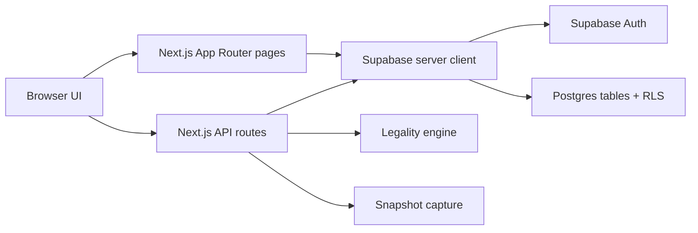
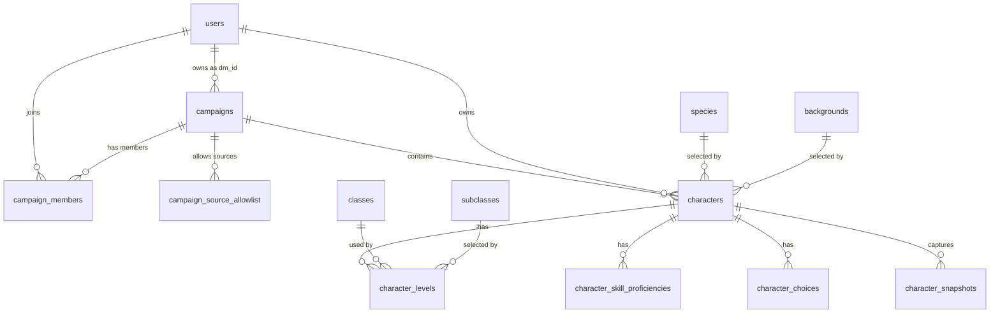

# Architecture Notes

This document summarizes the app architecture from repo evidence only.

## High-Level Shape

## Role Model

- `player`
  - can access their own characters
  - can create characters only in campaigns they belong to
- `dm`
  - owns campaigns through `campaigns.dm_id`
  - can only review campaigns and characters inside campaigns they own
  - can administer content

Role values are defined in [src/lib/types/database.ts](/Users/stephan/Documents/Coding%202026/dungeon-and-database/src/lib/types/database.ts).

## Main Data Model

The typed view of these tables lives in [src/lib/types/database.ts](/Users/stephan/Documents/Coding%202026/dungeon-and-database/src/lib/types/database.ts). Core schema history starts in `supabase/migrations/001_initial_schema.sql`.

## Request/Data Flow

### 1. Authenticated page load

- App pages create a Supabase server client
- The page fetches the current auth user and then app profile data from `users`
- The page fetches scoped campaign/character data
- The UI renders role-specific flows

Examples:
- DM dashboard: [src/app/dm/dashboard/page.tsx](/Users/stephan/Documents/Coding%202026/dungeon-and-database/src/app/dm/dashboard/page.tsx)
- Character page: [src/app/characters/[id]/page.tsx](/Users/stephan/Documents/Coding%202026/dungeon-and-database/src/app/characters/%5Bid%5D/page.tsx)

### 2. Character editing

- The player or DM edits the sheet in `CharacterSheet`
- The client sends a `PUT` request to `src/app/api/characters/[id]/route.ts`
- The API route updates the top-level character row, levels, skills, and choices
- The route captures a snapshot and recomputes legality before returning

### 3. Character review

- Player submits through `src/app/api/characters/[id]/submit/route.ts`
- DM requests changes through `src/app/api/characters/[id]/request-changes/route.ts`
- DM approves through `src/app/api/characters/[id]/approve/route.ts`
- Submit and approve also capture snapshots

## RLS and Authorization Strategy

There are two layers:

### Database layer

- Supabase RLS policies protect the public tables
- DM visibility is scoped to campaigns they own
- Recent policy tightening is in:
  - `supabase/migrations/016_scoped_dm_rls.sql`
  - `supabase/migrations/017_enable_rls_missing.sql`

### Application layer

- API routes use helpers such as `requireAuth`, `requireDm`, and the ownership assertions in [src/lib/auth/ownership.ts](/Users/stephan/Documents/Coding%202026/dungeon-and-database/src/lib/auth/ownership.ts)
- Middleware redirects authenticated users with missing profile rows back to `/login`
- DM pages explicitly `notFound()` or `403` when ownership checks fail

This means routes do not rely on RLS alone for cross-campaign safety.

## Legality Engine

The legality engine is advisory in the current implementation.

Pieces:
- Input builder: [src/lib/legality/build-input.ts](/Users/stephan/Documents/Coding%202026/dungeon-and-database/src/lib/legality/build-input.ts)
- Rule engine: [src/lib/legality/engine.ts](/Users/stephan/Documents/Coding%202026/dungeon-and-database/src/lib/legality/engine.ts)
- API entrypoint: [src/app/api/legality/check/route.ts](/Users/stephan/Documents/Coding%202026/dungeon-and-database/src/app/api/legality/check/route.ts)

Current behavior from repo evidence:
- legality can report errors and warnings
- submit returns legality results but does not block on them
- multiclass skill validation is not fully implemented and currently emits an advisory warning

## Snapshot System

Snapshot capture is centralized in [src/lib/snapshots.ts](/Users/stephan/Documents/Coding%202026/dungeon-and-database/src/lib/snapshots.ts).

Snapshots are taken:
- during full character save/update
- during submit
- during approve

Historical rows are stored in `character_snapshots`.

## Content Administration

DMs manage content through [src/components/dm/ContentAdmin.tsx](/Users/stephan/Documents/Coding%202026/dungeon-and-database/src/components/dm/ContentAdmin.tsx), which talks to content API routes under `src/app/api/content/`.

Managed content includes:
- backgrounds
- species
- classes
- subclasses
- spells
- feats
- sources

## Not Found In Repo

- A checked-in ERD or schema diagram image
- A checked-in `.env.example`
- A checked-in Supabase CLI config showing the exact migration command used by the project
